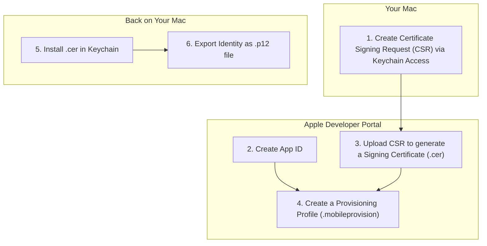
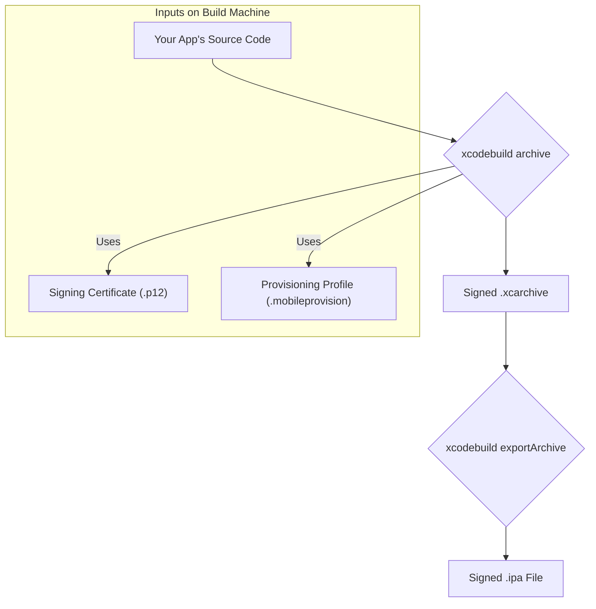
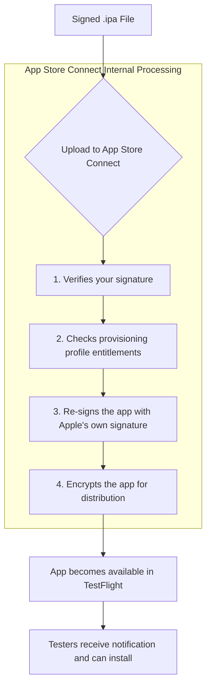

# Explained: Apple Code Signing and TestFlight Distribution

This document explains the end-to-end process of Apple's code signing for iOS apps and how a build gets distributed to testers via TestFlight.

## Part 1: The Core Components

Apple's code signing system is built on three core components that work together to verify the identity of the developer and the integrity of the app.

1.  **Signing Certificate (`.p12` file):** This is your digital identity as a developer. It contains a private and public key pair and proves that the app was created by you.
2.  **App ID:** A unique identifier for your application (e.g., `com.yourcompany.yourapp`). It registers your app with Apple.
3.  **Provisioning Profile (`.mobileprovision` file):** This is the glue that holds everything together. It's a file that links your developer certificate and your App ID, authorizing your app to be installed on specific devices or submitted to the App Store.

### How the Components are Created

This diagram shows the relationship between the components and how they are generated from your Apple Developer account.

---

## Part 2: The Build & Signing Process

When you build your app for release, Xcode (or `xcodebuild` on a CI server) uses these components to sign the application bundle.

### Build-Time Signing Flow

This diagram shows how the source code and signing components are combined to create a signed `.ipa` file.

---

## Part 3: TestFlight Distribution

Once you have a signed `.ipa` file, you upload it to App Store Connect. It then goes through Apple's own internal processing before being made available to your testers.

### TestFlight Processing Flow

This diagram illustrates what happens after your app is uploaded.

When a user installs the app from TestFlight, their device verifies Apple's signature, ensuring the app is authentic and has not been tampered with since it was uploaded.
