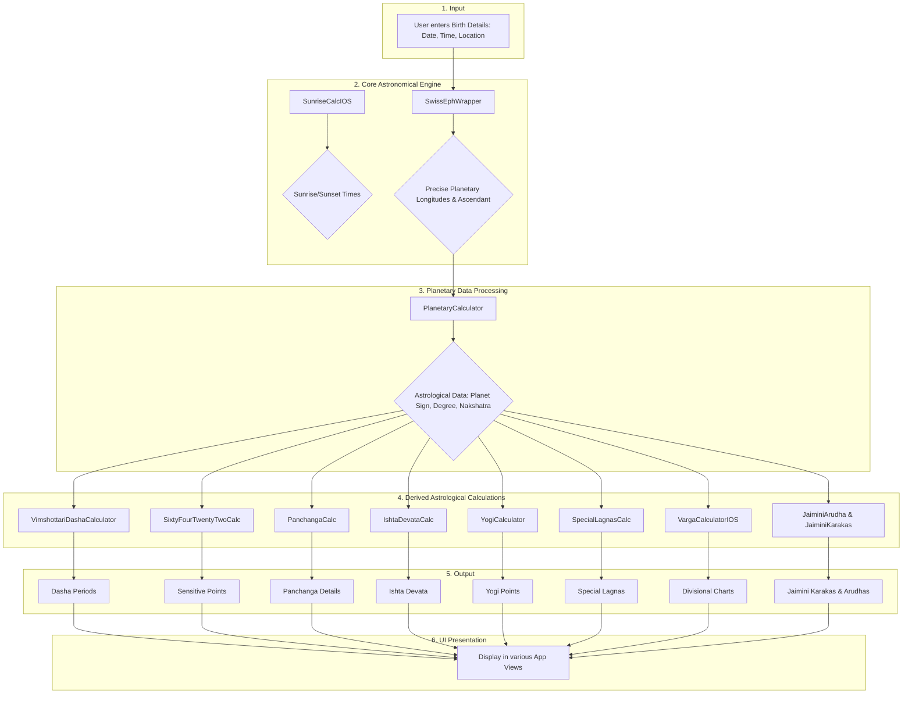

# Astrology Calculation Engine: Explained

This document provides a detailed explanation of the core astrological calculations performed within the Vedic Light application. It combines technical logic with astrological concepts to give a clear overview of how raw astronomical data is transformed into meaningful astrological insights.

## Overall Calculation Flow

The entire calculation process begins with user-provided birth details and flows through several stages of processing, from foundational astronomical calculations to derived astrological insights, which are finally presented to the user.



---

## Core Calculation Modules

### 1. Swiss Ephemeris Integration

*   **Astrological Concept:** The Swiss Ephemeris is a high-precision astronomical library that provides the foundational data for any horoscope: the positions of planets, houses, and other celestial points for a specific moment in time and location.
*   **Implementation:** The C-based Swiss Ephemeris library is integrated via an Objective-C wrapper (`SwissEphWrapper.m`). Swift code calls this wrapper to get the raw astronomical data.
*   **Relevant Files:** `NotesApp/SwissEphWrapper.m`, `NotesApp/SwissEphBridge.h`, `ThirdParty/SwissEph/`

### 2. Planetary Calculations (`PlanetaryCalculator.swift`)

*   **Astrological Concept:** This module translates the raw longitudes from the Swiss Ephemeris into an astrological context, determining each planet's sign, degree, Nakshatra (lunar mansion), and other properties.
*   **Flow:**
    ```mermaid
    graph LR
        A[Raw Longitude from SwissEph] --> B{PlanetaryCalculator};
        B --> C[Sign];
        B --> D[Degree within Sign];
        B --> E[Nakshatra & Pada];
        B --> F[Retrograde Status];
    end
    ```

### 3. Vimshottari Dasha (`VimshottariDashaCalculator.swift`)

*   **Astrological Concept:** A timing system in Vedic astrology that divides life into planetary periods (Dashas), indicating phases of life and their corresponding themes.
*   **Methodology:** The calculation begins from the Moon's position at birth. The Nakshatra the Moon is in determines the first Dasha lord, and the distance the Moon has traveled through that Nakshatra determines the remaining period of that first Dasha. Subsequent Dashas follow a fixed sequence.
*   **Flow:**
    ```mermaid
    graph TD
        A[Moon's Longitude at Birth] --> B{Find Moon's Nakshatra};
        B --> C{Determine Starting Dasha Lord & Balance Period};
        C --> D[Calculate Sequence of Mahadashas];
        D --> E[Proportionally calculate Antardashas within each Mahadasha];
        E --> F[Proportionally calculate Pratyantardashas within each Antardasha];
        F --> G[Output: Hierarchical Dasha Periods with start/end dates];
    end
    ```

### 4. Panchanga Calculation (`PanchangaCalc.swift`)

*   **Astrological Concept:** The "five limbs" of the Vedic day (Tithi, Vara, Nakshatra, Yoga, Karana), which are essential for understanding the energy of a specific day, particularly for electional astrology (Muhurta).
*   **Flow:**
    ```mermaid
    graph TD
        subgraph "Inputs"
            A[Sun Longitude]
            B[Moon Longitude]
            C[Day of Week]
        end
        subgraph "Calculations"
            D{Angular Distance between Sun & Moon} --> E[Tithi]
            E --> F[Karana (Half Tithi)]
            G{Sum of Sun & Moon Longitudes} --> H[Yoga]
            B --> I[Nakshatra]
            C --> J[Vara]
        end
        subgraph "Output"
            E & F & H & I & J --> K[Panchanga Details]
        end
    end
    ```

### 5. Varga (Divisional Chart) Calculation (`VargaCalculatorIOS.swift`)

*   **Astrological Concept:** Vargas are "divisions" of the main chart that provide a magnified view of specific areas of life. For example, the Navamsha (D-9) chart is crucial for marriage and dharma.
*   **Methodology:** Each Varga divides a sign into a number of segments. A planet's position in the Varga chart is determined by which segment it occupies in the main chart.
*   **Flow:**
    ```mermaid
    graph TD
        A[Planet's Longitude & Varga Number (e.g., 9 for Navamsha)] --> B{Calculate Position within the Sign};
        B --> C{Apply Varga Formula to find position in the divisional chart};
        C --> D{Determine the Sign of the planet in the Varga Chart};
        D --> E[Output: Planet's new position in the Varga Chart];
    end
    ```

### 6. Jaimini Astrology Calculations (`JaiminiKarakas.swift`, `JaiminiArudha.swift`)

*   **Astrological Concept:** A unique system within Vedic astrology that uses a different set of significators (Karakas) and "image" houses (Arudha Padas) to analyze a chart.
*   **Karakas Flow:**
    ```mermaid
    graph TD
        A[Get Longitudes of all Planets] --> B{Extract Degree of each Planet within its Sign};
        B --> C{Sort Planets by Degree (High to Low)};
        C --> D[Assign Karaka Status based on Rank];
        subgraph D
            D1[Rank 1: Atmakaraka (Soul)]
            D2[Rank 2: Amatyakaraka (Career)]
            D3[...]
            D4[Rank 7: Darakaraka (Spouse)]
        end
        D --> E[Output: List of Jaimini Karakas];
    end
    ```
*   **Arudha Pada Flow:**
    ```mermaid
    graph TD
        A{For a given house (e.g., 1st House)} --> B{Find the Lord of that House};
        B --> C{Count signs from the House to its Lord};
        C --> D{Count the same number of signs from the Lord};
        D --> E[The resulting sign is the Arudha Pada];
    end
    ```

### 7. Other Specialized Calculations

*   **Ishta Devata (`IshtaDevataCalc.swift`):** Determines a personal deity for spiritual guidance, often derived from the Atmakaraka's position in the Navamsha chart.
*   **Yogi/Avayogi (`YogiCalculator.swift`):** Calculates points of prosperity (Yogi) and obstruction (Avayogi) based on the sum of the Sun and Moon's longitudes.
*   **64th Navamsha & 22nd Drekkana (`SixtyFourTwentyTwoCalc.swift`):** Identifies sensitive points in the chart related to vulnerability and karmic patterns.
*   **Special Lagnas (`SpecialLagnasCalc.swift`):** Computes alternative ascendants like Hora Lagna (wealth) and Ghatika Lagna (power) to analyze specific facets of life.
