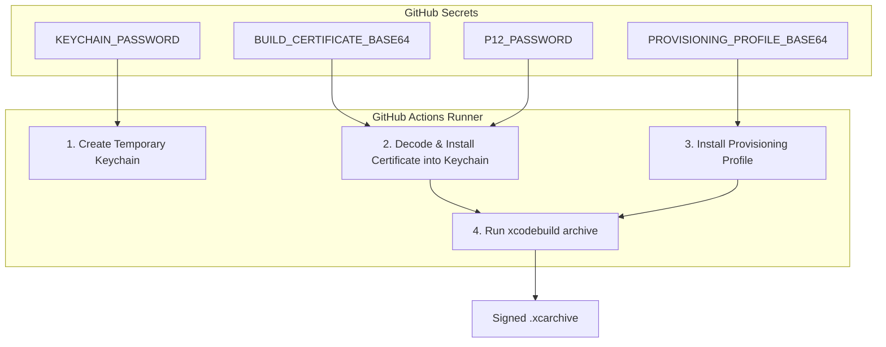
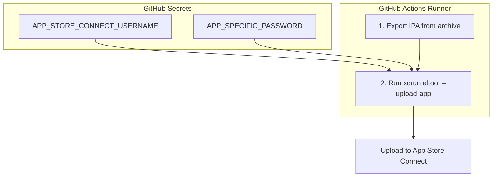

# A Guide to Secrets in This Repository

This document details the secrets currently configured in this repository, as identified by the `gh` CLI. It explains the purpose of each secret and illustrates its role in the CI/CD workflow.

## Secrets Currently in Use

A recent check using `gh secret list` shows the following secrets are active:

```
NAME                         UPDATED
APP_SPECIFIC_PASSWORD        ...
APP_STORE_CONNECT_USERNAME   ...
BUILD_CERTIFICATE_BASE64     ...
IOS_TEAM_ID                  ...
KEYCHAIN_PASSWORD            ...
P12_PASSWORD                 ...
PROVISIONING_PROFILE_BASE64  ...
```

These secrets are primarily used for two critical processes: **Code Signing** and **App Store Upload**.

---

## 1. The Code Signing Process

Signing the app is essential for security and is required by Apple. The following secrets are used to achieve this on the GitHub Actions runner.

*   **`BUILD_CERTIFICATE_BASE64`**: Your distribution certificate (`.p12` file) encoded for storage.
*   **`P12_PASSWORD`**: The password for the `.p12` certificate.
*   **`PROVISIONING_PROFILE_BASE64`**: The `.mobileprovision` file that links your certificate to your app, also encoded.
*   **`KEYCHAIN_PASSWORD`**: A password to create a secure temporary keychain on the runner.
*   **`IOS_TEAM_ID`**: Your Apple Developer Team ID, required by Xcode.

### Code Signing Flow

This diagram illustrates how the signing secrets are used to produce a signed app archive.



---

## 2. The App Store Upload Process

After the app is built and signed, it needs to be uploaded to App Store Connect. Your repository is configured to use the legacy Apple ID and app-specific password method for this.

*   **`APP_STORE_CONNECT_USERNAME`**: The Apple ID used for the upload.
*   **`APP_SPECIFIC_PASSWORD`**: An app-specific password generated for that Apple ID.

### App Store Upload Flow

This diagram shows how the authentication secrets are used by `altool` to upload the app.


