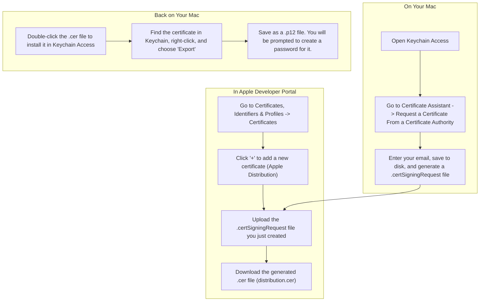
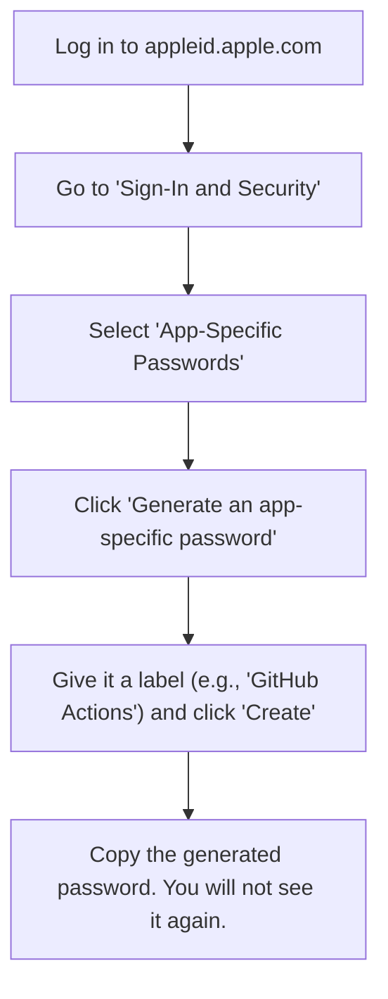
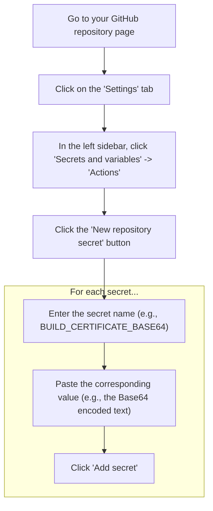

# A Step-by-Step Guide to iOS Deployment Secrets

This document provides a complete tutorial on how to generate and configure all the secrets required for automating your iOS builds and deploying to TestFlight using GitHub Actions.

## Introduction: What Are We Doing and Why?

To automatically build and upload an iOS app, our CI/CD workflow needs to perform two sensitive operations: **Code Signing** and **Authentication with Apple**. We use GitHub Secrets to securely provide the necessary credentials (certificates, passwords, API keys) to the workflow without exposing them in our code.

---

## Part 1: Generating Code Signing Credentials

This involves creating a **Signing Certificate** and a **Provisioning Profile**.

### Step 1: Create the Signing Certificate (.p12)

The `.p12` file is your digital identity. It contains your cryptographic keys for signing.



*   **Result:** You now have a `.p12` file and a password for it. These will become the `BUILD_CERTIFICATE_BASE64` and `P12_PASSWORD` secrets.

### Step 2: Create the Provisioning Profile (.mobileprovision)

This file connects your App ID and your certificate, authorizing a build for the App Store.

1.  **Navigate** to `Certificates, Identifiers & Profiles -> Profiles` in the Apple Developer Portal.
2.  **Click** `+` to add a new profile.
3.  **Select** `App Store` under the Distribution section.
4.  **Choose** the correct App ID for your application.
5.  **Select** the distribution certificate you created in the previous step.
6.  **Give** the profile a descriptive name and click `Generate`.
7.  **Download** the resulting `.mobileprovision` file.

*   **Result:** You now have a `.mobileprovision` file. This will become the `PROVISIONING_PROFILE_BASE64` secret.

---

## Part 2: Generating App Store Connect Credentials

Your repository uses the Apple ID and an App-Specific Password. Here is how to get them.

### App-Specific Password Flow



*   **Result:** You now have an app-specific password. This will become the `APP_SPECIFIC_PASSWORD` secret. The `APP_STORE_CONNECT_USERNAME` will be your Apple ID email.

---

## Part 3: Preparing Secrets for GitHub

Because certificate and profile files are binary, they must be Base64 encoded to be stored as text in GitHub Secrets.

1.  **Open** the Terminal app on your Mac.
2.  **Navigate** to the directory where you saved your `.p12` and `.mobileprovision` files.
3.  **Run** the following commands:

    ```bash
    # Encode the .p12 certificate
    base64 -i YourCertificate.p12 -o YourCertificate.p12.txt

    # Encode the .mobileprovision profile
    base64 -i YourProfile.mobileprovision -o YourProfile.mobileprovision.txt
    ```
4.  **Open** the resulting `.txt` files. You will copy the contents of these files into GitHub.

---

## Part 4: Adding Secrets to Your GitHub Repository

This diagram shows where to add the secrets in your repository settings.



**You will need to create a secret for each of the following:**

*   `BUILD_CERTIFICATE_BASE64`: The encoded content from `YourCertificate.p12.txt`.
*   `P12_PASSWORD`: The password you set for the `.p12` file.
*   `PROVISIONING_PROFILE_BASE64`: The encoded content from `YourProfile.mobileprovision.txt`.
*   `KEYCHAIN_PASSWORD`: A new, strong random password. It's only used by the workflow.
*   `IOS_TEAM_ID`: Your 10-character Team ID from the Apple Developer Portal.
*   `APP_STORE_CONNECT_USERNAME`: Your Apple ID email.
*   `APP_SPECIFIC_PASSWORD`: The app-specific password you generated.
