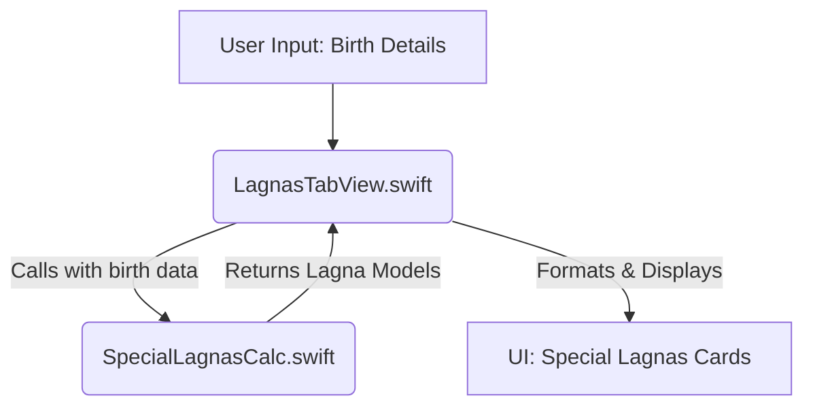
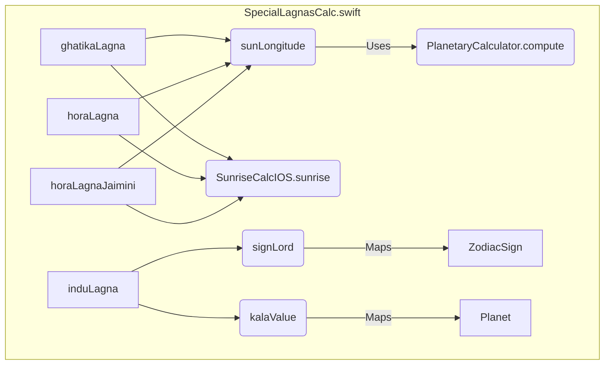

# Lagnas Page Logic Diagrams

Here are conceptual diagrams illustrating the logic flow and component interactions for the Lagnas page, using Mermaid syntax. You can render these diagrams using any Mermaid-compatible viewer.

## 1. High-Level Interaction Flow

This diagram shows how the `LagnasTabView` interacts with the `SpecialLagnasCalc` to process user input and display the results.

**Explanation:**
*   **User Input**: The process begins with the user providing birth details (date, time, location, etc.).
*   **`LagnasTabView.swift`**: This SwiftUI view receives the user input. It acts as the orchestrator, preparing the data and calling the necessary calculation functions.
*   **`SpecialLagnasCalc.swift`**: This file contains the core logic for calculating various Lagnas. It receives processed birth data from `LagnasTabView`.
*   **Returns Lagna Models**: `SpecialLagnasCalc` performs the computations and returns structured data models (e.g., `GhatikaLagnaModel`, `HoraLagnaModel`, `InduLagnaModel`) back to `LagnasTabView`.
*   **UI Display**: `LagnasTabView` then takes these models, converts them into a display-friendly format, and renders them as interactive cards in the user interface.

## 2. Detailed `SpecialLagnasCalc.swift` Internal Flow

This diagram illustrates the internal dependencies and calls within the `SpecialLagnasCalc.swift` file for its main Lagna calculation functions and their helper functions.

**Explanation of Components:**
*   **`ghatikaLagna`**: Calculates Ghatika Lagna. Depends on `sunLongitude` and `SunriseCalcIOS.sunrise`.
*   **`horaLagna`**: Calculates standard Hora Lagna. Depends on `sunLongitude` and `SunriseCalcIOS.sunrise`.
*   **`horaLagnaJaimini`**: Calculates Jaimini Hora Lagna. Depends on `sunLongitude` and `SunriseCalcIOS.sunrise`.
*   **`induLagna`**: Calculates Indu Lagna. Depends on `signLord` and `kalaValue`.
*   **`sunLongitude`**: A helper function to get the Sun's longitude. It internally uses `PlanetaryCalculator.compute`.
*   **`SunriseCalcIOS.sunrise`**: An external dependency (presumably from `SunriseCalcIOS.swift`) to get sunrise times.
*   **`PlanetaryCalculator.compute`**: An external dependency (presumably from `PlanetaryCalculator.swift`) to compute planetary positions.
*   **`signLord`**: A helper function that maps a `ZodiacSign` to its ruling planet.
*   **`kalaValue`**: A helper function that assigns numerical values to planets.
*   **`ZodiacSign`**: Represents the input/output for `signLord`.
*   **`Planet`**: Represents the input/output for `kalaValue`.

This breakdown highlights the modularity of the `SpecialLagnasCalc` and its reliance on specific helper functions and external calculators to perform its complex astrological computations.
