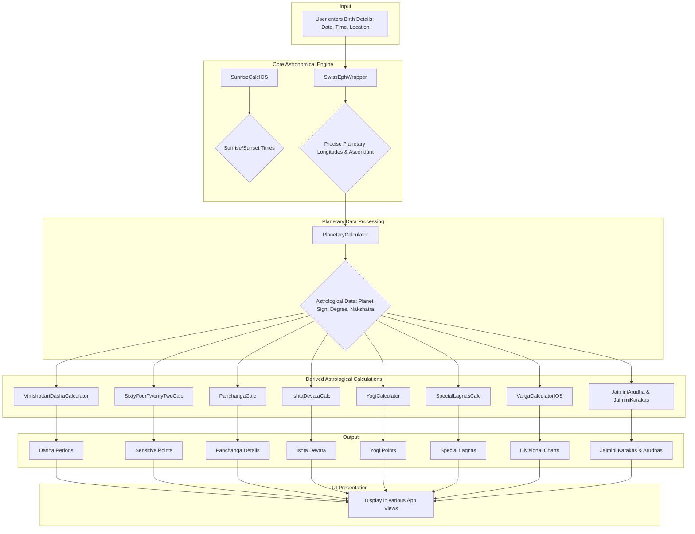
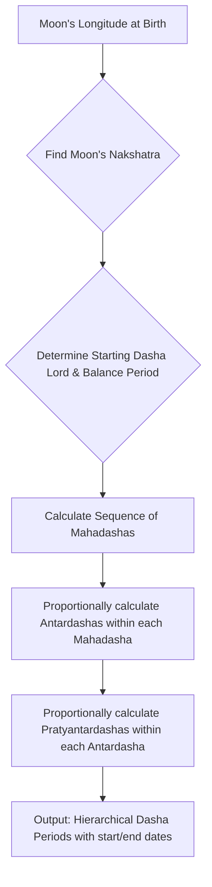
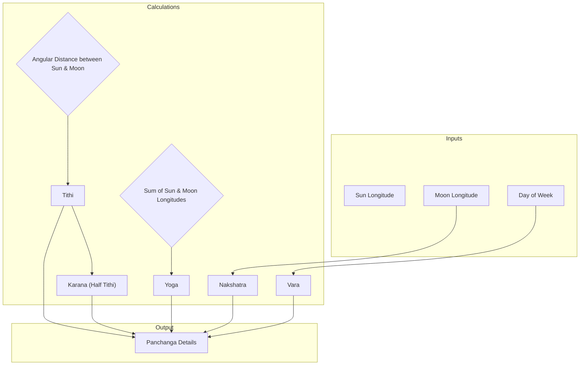
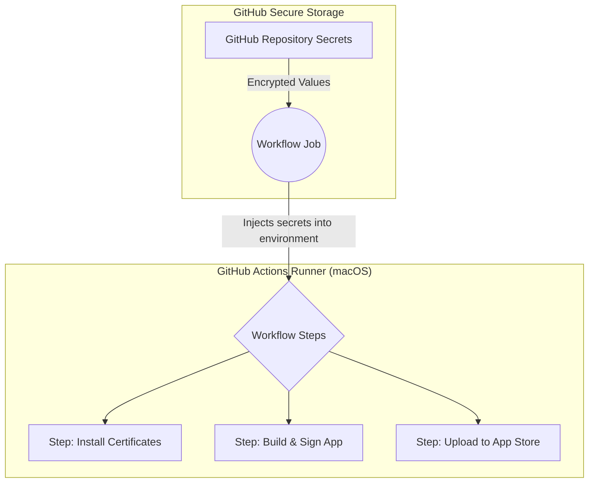
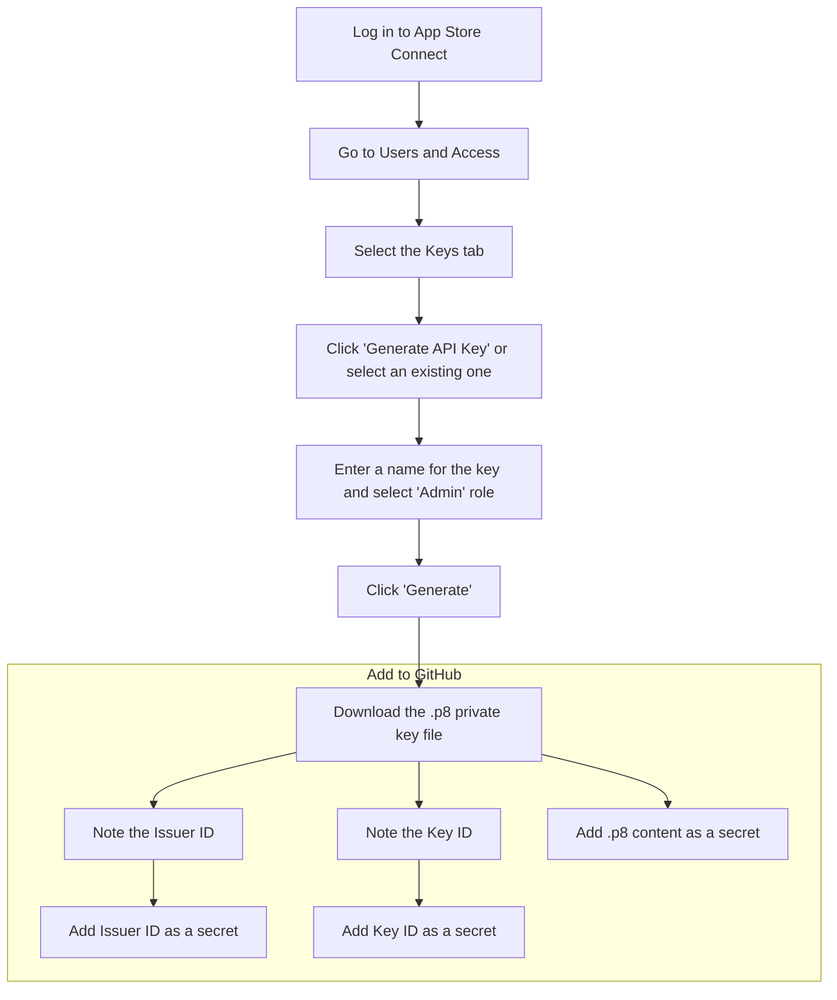

# Project Workflow Diagrams

This file contains diagrams illustrating the various calculation and deployment workflows in the project.

## Overall Calculation Flow

This diagram shows the end-to-end flow from user input to the final astrological calculations.

## Vimshottari Dasha Calculation

This diagram illustrates how the Vimshottari Dasha periods are calculated from the Moon's position at birth.

## Panchanga Calculation

This diagram shows how the five limbs of the Vedic day (Panchanga) are calculated.

## CI/CD Secrets Workflow

This diagram shows how secrets are securely used in the GitHub Actions deployment workflow.

## App Store Connect API Key Generation

This diagram explains how to generate the necessary API keys for uploading to the App Store.

