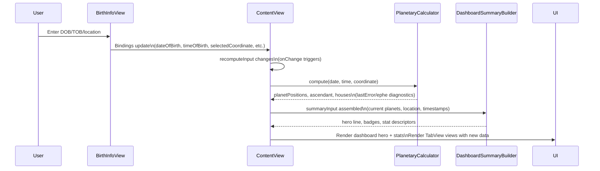
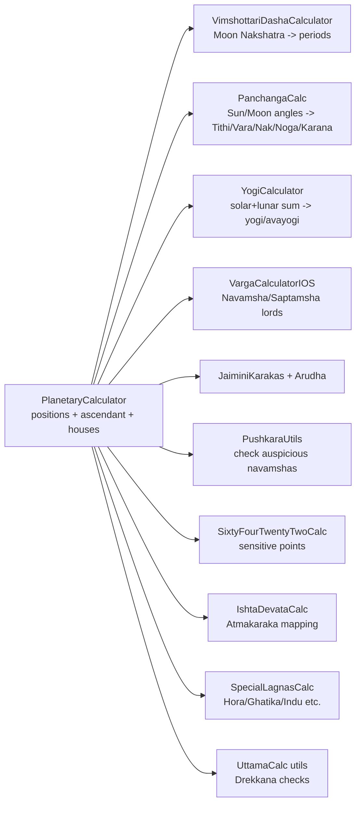

# Logic Diagrams

Visual guides for the most important runtime flows in the app. These use Mermaid so you can preview them in GitHub or supported Markdown viewers.

## 1) Planetary computation pipeline

```mermaid
flowchart TD
    DOB[Date of birth] --> MERGE
    TOB[Time of birth] --> MERGE
    GEO[Geolocation\n(CLLocationCoordinate2D)] --> TZ
    TZ[Determine timezone\n(Asia/Kolkata if in India; else device)] --> MERGE[Merge date + time\n-> single Date]
    MERGE --> JD[Julian Day (UT)\nvia julianDayUT]
    JD --> EPHE[Resolve SwissEph path\n(bundle lookup)]
    EPHE --> CALC[swe_bridged_calc_lon_speed\nfor Sun/Moon/planets + node]
    CALC --> POS[PlanetPosition array\n+ retrograde flags]
    POS --> KETU[Ketu derived from Rahu + 180°]
    JD --> HOUSES[swe_bridged_houses_placidus\nAsc + 12 house cusps]
    KETU --> OUTPUT[Outputs:\n[PlanetPosition], ascendant, houses,\ndiag logs, ephemeris metadata]
    HOUSES --> OUTPUT
```

## 2) ContentView recompute + dashboard flow



## 3) Derived calculators fan-out



### Reading the diagrams

- Gray boxes = Swift-only calculators; the Swiss Ephemeris bridge remains encapsulated in `PlanetaryCalculator`.
- `ContentView` is the only place that triggers recompute; every tab reads the resulting state via bindings to avoid desynchronisation.

